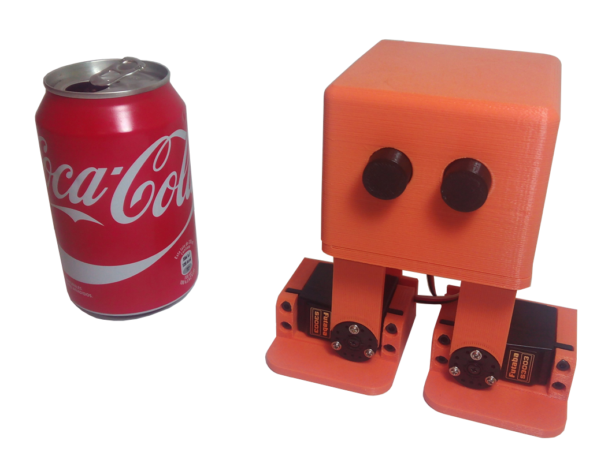
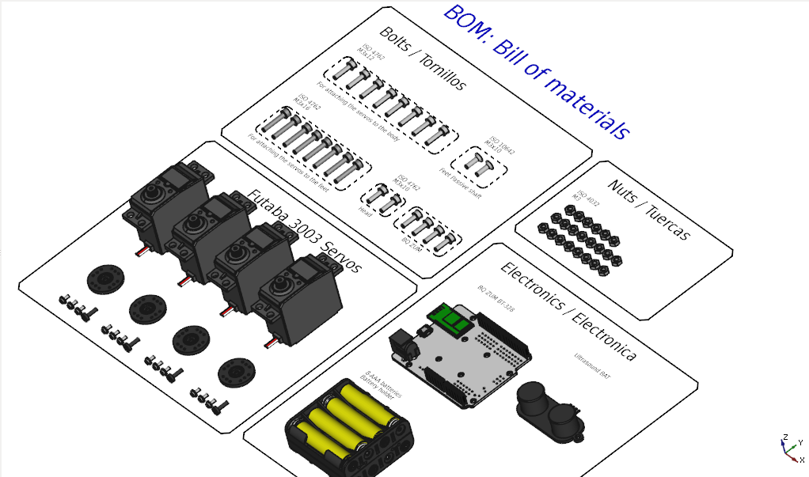
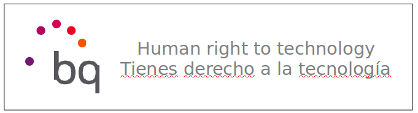

# ZOWI

In this repository you will find the source files for the **bq Zowi** robot. If you are missing something, please do not hesitate to [file an issue on github](https://github.com/bq/zowiissues)

En este repositorio se encuentran los ficheros fuente del robot **Zowi de bq**. Si echas en falta algo, no dudes en [rellenar una tarea en github](https://github.com/bq/zowi/issues)

 

More information in this post in DIWO: [Zowi, introducción a los robots bípedos](http://diwo.bq.com/zowi-introduccion-a-los-robots-bipedos/) (In spanish)

## Designed in Freecad

Zowi is not only an open source robot, but it has also been designed using the open source tool FreeCAD. This way, anyone can open the parts, study them, modify them and distribute the modifications

 

# BOM: Bill of Materials

 

* 4 Futaba 3003 servos or compatibles
* 6 M3x10 Bolts (ISO 4762)
* 2 M3x10 Bolts (ISO 10642)
* 8 M3x12 Bolts (ISO 4762)
* 8 M3x16 Bolts (ISO 4762)
* 22 M3 nuts (ISO 4032)
* 1 BQ ZUM BT328 or Arduino
* 4 x 2 AAA Battery holder
* 8 AAA bateries

# License 

This robot is licensed under a [Creative Commons Attribution-ShareAlike 4.0 International License](http://creativecommons.org/licenses/by-sa/4.0/). Please read the LICENSE files for more details.

Este robot tiene una licencia [Creative Commons Attribution-ShareAlike 4.0 International License](http://creativecommons.org/licenses/by-sa/4.0/). Por favor, lea los ficheros LICENSE para más detalles

Original concept by [k120189](http://www.thingiverse.com/k120189/about) on [Thingiverse](http://www.thingiverse.com/thing:43708)

More information: [Zowi CC-BY-SA](http://diwo.bq.com/zowi-cc-by-sa/)

# Other

Sponsored by BQ till march 2016
