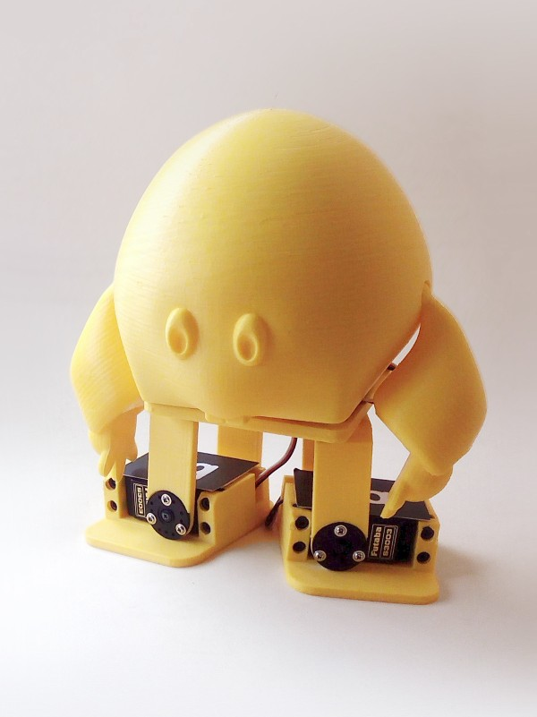
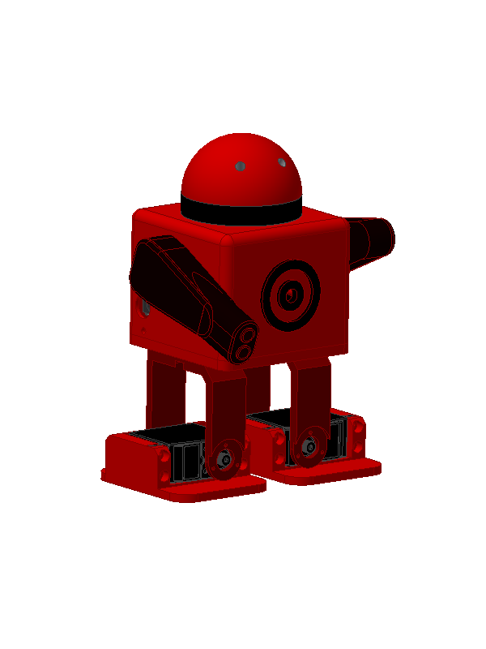
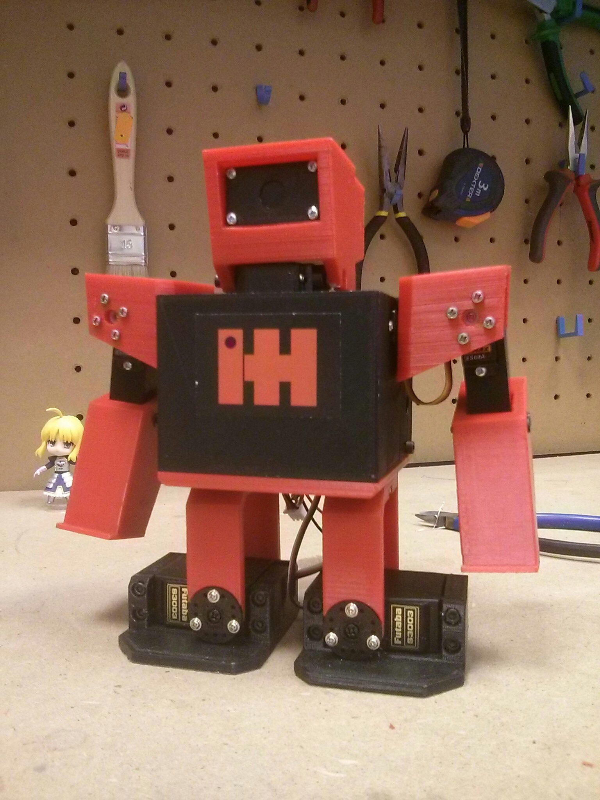
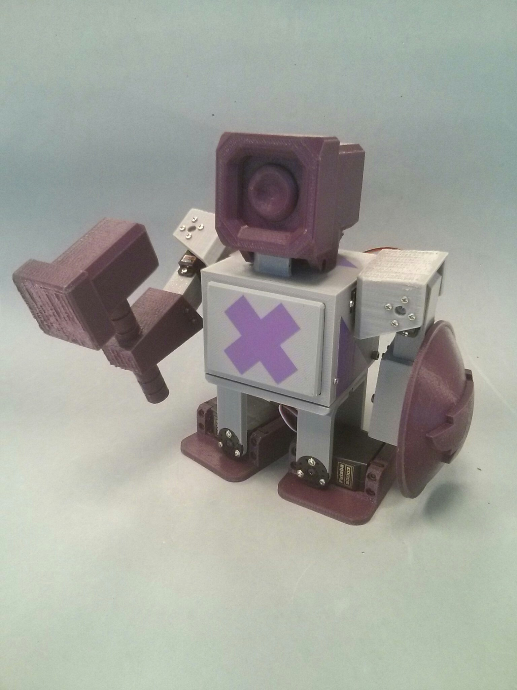
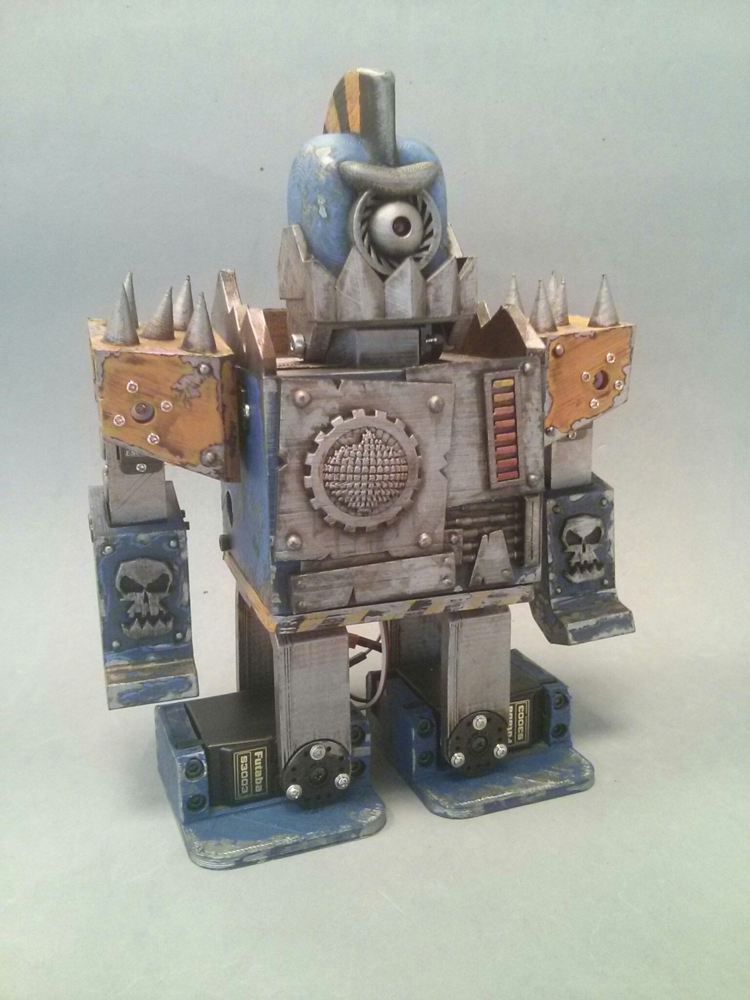
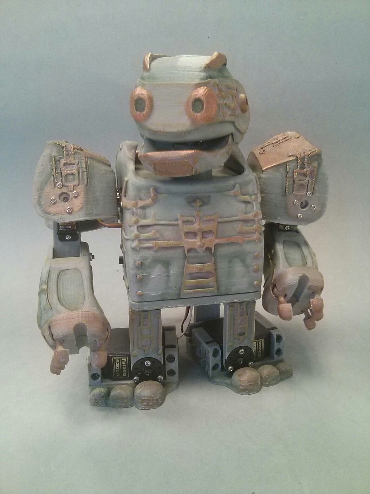
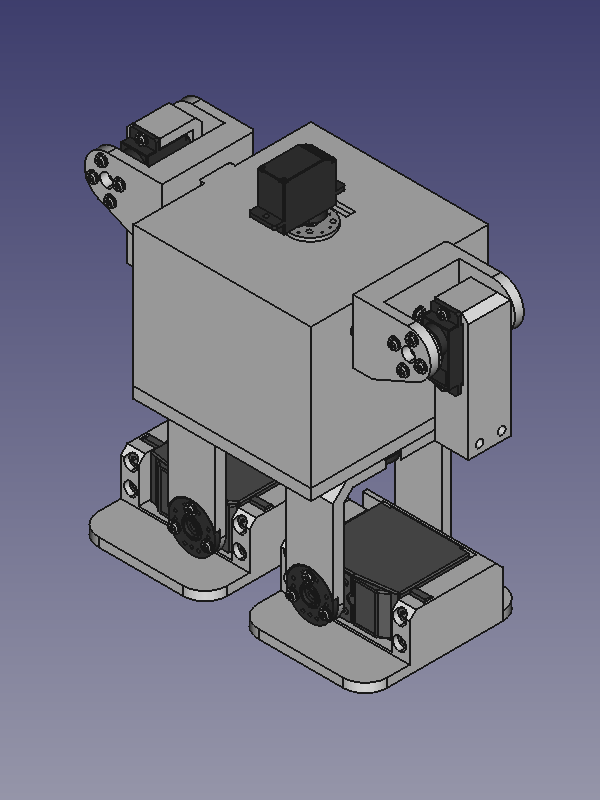
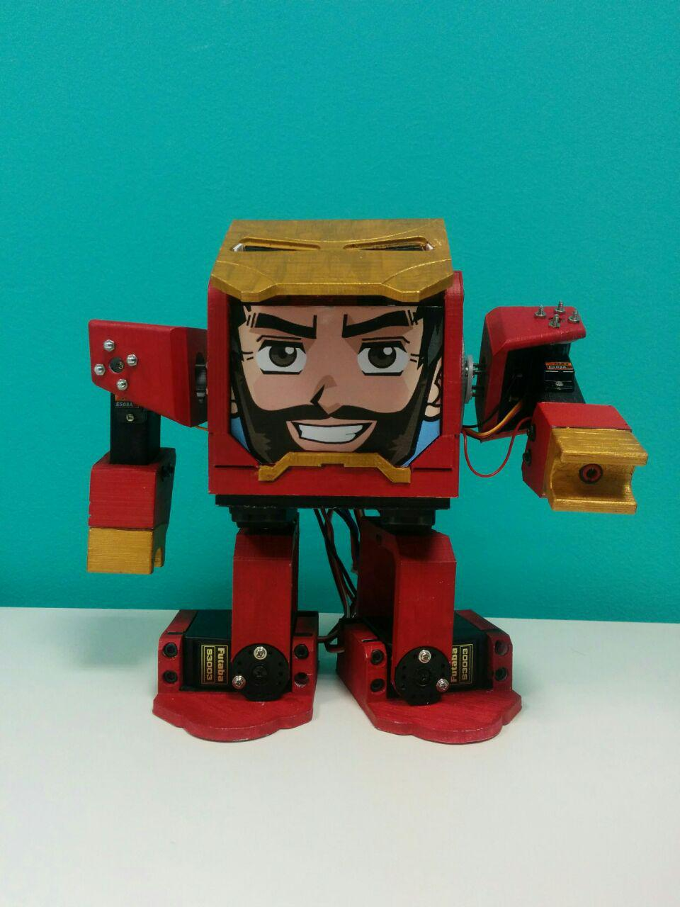

#Zowi mods

| JIM | Scopum | Micro Raider |
| ------------- | ------------- | ------------- | ------------- |
|  |  |  |
| By [Sonia Verdú](http://www.soniaverdu.es/) | By [Macarena González](https://github.com/MacarenaGB)| By  [Javier Isabel](https://github.com/JavierIH)|

| Forge | Zowiquilator | Kobuki |
| ------------- | ------------- | ------------- | ------------- |
| |  |  |
| By [David Sánchez](https://github.com/davidsanfal) | by [Alberto Arribas](http://www.albertoarribasart.com/)  | By [Sonia Verdú](http://www.soniaverdu.es/) |

| Zowimanoid (template)| IronZowi |  |
| ------------- | ------------- | ------------- | ------------- |
|  | | |
| By  [Javier Isabel](https://github.com/JavierIH) | By  [Gianluca Pugliese](https://github.com/owenlab) | |
