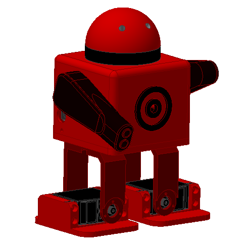

# Scopum

Scopum has been created by [HackLab UPM Bq](http://hacklabupm.bq.com/doku.php?id=start). 
He has been designed in order to have a battle with more Scopums. He has a target in the chest with a receptor fototransistor and a emisor diode in the weapon which is in his arm. Besides, he include a buzzer destinated to make sound when he shoots and when he dies.

Original concept by [JavierIH](https://github.com/JavierIH) on [Github](https://github.com/bq/zowi)

# License 

This robot is licensed under a [Creative Commons Attribution-ShareAlike 4.0 International License](http://creativecommons.org/licenses/by-sa/4.0/). Please read the LICENSE files for more details.

Este robot tiene la licencia [Creative Commons Attribution-ShareAlike 4.0 International License](http://creativecommons.org/licenses/by-sa/4.0/). Por favor, lea los ficheros LICENSE para más detalles
